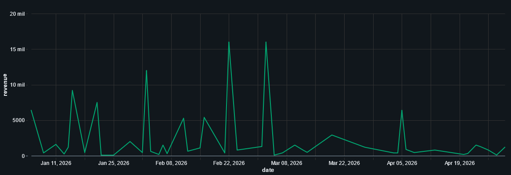
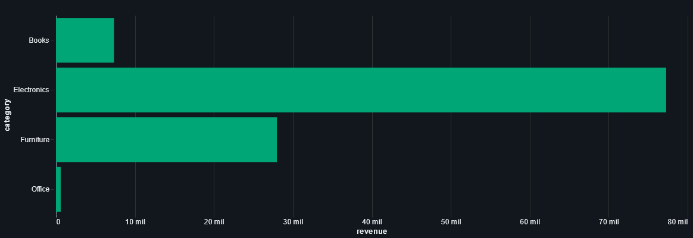

## 🚀 Databricks Sales Lakehouse

Projeto de Engenharia de Dados desenvolvido com **Databricks**, **PySpark**, **Delta Lake**, **SQL** e arquitetura **Medallion**.

O objetivo é simular um pipeline real de vendas de e-commerce, passando por ingestão de dados brutos, tratamento e padronização, validações de qualidade, criação de tabelas analíticas e visualizações de negócio a partir da camada Gold.

---

## 🎯 Objetivo

Construir um fluxo de dados em camadas seguindo a arquitetura Medallion:

* **Bronze:** ingestão dos dados crus, mantendo fidelidade ao formato original.
* **Silver:** limpeza, padronização, tipagem, deduplicação e separação de registros inválidos.
* **Gold:** criação de tabelas analíticas para consumo em SQL, dashboards e análises de negócio.

---

## 🛠️ Stack utilizada

* Databricks
* PySpark
* Delta Lake
* SQL
* Python
* Arquitetura Medallion
* Data Quality Checks
* Databricks Visualizations

---

## 📁 Estrutura do projeto

```text
.
├── data/
│   └── raw/
│       ├── customers/
│       ├── products/
│       ├── orders/
│       └── payments/
│
├── notebooks/
│   ├── 00_setup.py
│   ├── 01_bronze_ingestion.py
│   ├── 02_silver_transformations.py
│   ├── 03_gold_analytics.py
│   └── 04_data_quality_checks.py
│
├── scripts/
│   └── generate_fake_data.py
│
├── sql/
│   └── dashboard_queries.sql
│
├── docs/
│   ├── images/
│   │   ├── daily_revenue.png
│   │   └── revenue_by_category.png
│   ├── architecture.md
│   └── data_dictionary.md
│
└── README.md
```

---

## 🔄 Pipeline

```text
Arquivos CSV/JSON
        ↓
Bronze - dados crus
        ↓
Silver - dados limpos, padronizados e validados
        ↓
Gold - métricas e tabelas analíticas
        ↓
SQL / Visualizações / Dashboard
```

---

## 🧪 Datasets simulados

O projeto utiliza dados fictícios de uma operação de e-commerce:

* clientes
* produtos
* pedidos
* pagamentos

Os dados foram criados com problemas comuns em pipelines reais, como:

* registros duplicados
* valores nulos
* datas inválidas
* status inconsistentes
* valores negativos
* pedidos sem cliente válido
* produtos inválidos
* divergência entre valor do pedido e pagamento

Esses problemas são tratados na camada Silver, onde os registros válidos seguem para consumo analítico e os inválidos são separados em tabelas de rejeição.

---

## 🗂️ Tabelas criadas

### 🥉 Bronze

Tabelas com os dados brutos, próximos ao formato original dos arquivos.

* `bronze_customers`
* `bronze_products`
* `bronze_orders`
* `bronze_payments`

### 🥈 Silver

Tabelas tratadas, padronizadas e validadas.

* `silver_customers`
* `silver_products`
* `silver_orders`
* `silver_payments`
* `silver_order_details`
* `silver_rejected_orders`
* `silver_rejected_products`

### 🥇 Gold

Tabelas analíticas para consumo em SQL e visualizações.

* `gold_daily_sales`
* `gold_sales_by_category`
* `gold_top_customers`
* `gold_payment_summary`
* `gold_order_status_summary`

### ✅ Data Quality

Tabela com o resultado das validações do pipeline.

* `dq_results`

---

## 🔧 Principais transformações

Na camada Silver são aplicadas regras como:

* conversão segura de tipos de dados
* tratamento de datas inválidas
* padronização de textos
* normalização de status de pedidos e pagamentos
* remoção de duplicados
* validação de campos obrigatórios
* validação de clientes e produtos existentes
* cálculo do valor total do pedido
* separação de registros rejeitados com motivo de erro

---

## 📌 Perguntas respondidas pela camada Gold

A camada Gold foi modelada para responder perguntas de negócio como:

* Qual é o faturamento diário?
* Qual é o ticket médio por dia?
* Quais categorias geram mais receita?
* Quais clientes mais compram?
* Qual é a distribuição dos status dos pedidos?
* Quais métodos de pagamento concentram maior volume financeiro?

---

## 📊 Dashboard Preview

As tabelas da camada Gold foram utilizadas para criar visualizações analíticas no Databricks, demonstrando como os dados tratados podem ser consumidos em análises de negócio.

O dashboard inicial foca em duas visões principais:

- **Daily Revenue:** evolução diária da receita a partir dos pedidos válidos.
- **Revenue by Category:** distribuição da receita por categoria de produto.

### 📈 Daily Revenue

<div align="center">
  
</div>

### 🏷️ Revenue by Category

<div align="center">
  
</div>

---

## 🧾 Consultas utilizadas nas visualizações

### 📈 Daily Revenue

```sql
SELECT
  CAST(order_date AS DATE) AS date,
  CAST(gross_revenue AS DOUBLE) AS revenue
FROM sales_lakehouse.gold_daily_sales
ORDER BY date;
```

### 🏷️ Revenue by Category

```sql
SELECT
  category,
  CAST(gross_revenue AS DOUBLE) AS revenue
FROM sales_lakehouse.gold_sales_by_category
ORDER BY revenue DESC;
```

---

## ✅ Data Quality

O projeto inclui uma etapa de validação de qualidade dos dados, registrando os resultados na tabela `dq_results`.

Exemplos de checks realizados:

* verificação de tabelas vazias
* identificação de duplicidade em pedidos
* validação de quantidades inválidas
* validação de chaves obrigatórias
* verificação de divergência entre valor do pedido e pagamento
* validação da existência de dados na camada Gold

Os resultados são classificados como:

* `PASS`
* `WARN`
* `FAIL`

---

## ▶️ Como rodar no Databricks

### 1. Criar ou acessar um workspace Databricks

O projeto pode ser executado em um workspace Databricks Free, Community, Trial ou corporativo.

### 2. Subir os dados para o Databricks

Suba a pasta `data/raw` para um caminho no Databricks, por exemplo:

```text
/Volumes/workspace/default/sales_lakehouse/raw
```

A estrutura esperada é:

```text
/Volumes/workspace/default/sales_lakehouse/raw/customers/customers.csv
/Volumes/workspace/default/sales_lakehouse/raw/products/products.csv
/Volumes/workspace/default/sales_lakehouse/raw/orders/orders_2026_q1.csv
/Volumes/workspace/default/sales_lakehouse/raw/orders/orders_2026_q2.csv
/Volumes/workspace/default/sales_lakehouse/raw/payments/payments_2026.json
```

Também é possível ajustar o caminho diretamente nos widgets dos notebooks.

### 3. Importar os notebooks

Importe os arquivos da pasta `notebooks/` no Databricks.

### 4. Rodar os notebooks na ordem

```text
00_setup.py
01_bronze_ingestion.py
02_silver_transformations.py
03_gold_analytics.py
04_data_quality_checks.py
```

### 5. Criar visualizações

Use o arquivo:

```text
sql/dashboard_queries.sql
```

ou execute as consultas SQL diretamente no Databricks para criar gráficos e visualizações a partir das tabelas Gold.

---

## 🧬 Como gerar novos dados localmente

Para gerar uma nova massa de dados fictícios:

```bash
python scripts/generate_fake_data.py
```

O script recria os arquivos em:

```text
data/raw/
```

---

## 🚧 Possíveis evoluções

* Ingestão incremental com Auto Loader
* Orquestração com Databricks Workflows
* Integração com cloud storage
* Particionamento das tabelas Delta
* Uso de Merge/Upsert com Delta Lake
* Uso de Change Data Feed
* Criação de testes automatizados de qualidade de dados
* Monitoramento com logs técnicos
* Expansão do dashboard com mais métricas de negócio
* Integração com LangGraph/LangSmith para análise inteligente dos resultados de Data Quality

---

## 🧠 Resumo técnico

Este projeto demonstra conceitos fundamentais de Engenharia de Dados em ambiente Lakehouse:

* ingestão de arquivos CSV/JSON
* processamento com PySpark
* armazenamento em Delta Lake
* arquitetura Medallion
* tratamento e validação de dados
* separação de registros rejeitados
* criação de tabelas analíticas
* consultas SQL para consumo da camada Gold
* visualizações analíticas no Databricks

---

## 👨‍💻 Autor

Projeto desenvolvido para estudo e portfólio em Engenharia de Dados.
